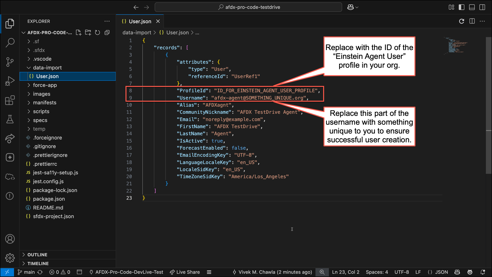

# AFDX Pro-Code Testdrive

A hands-on project for learning how to create next-gen Agentforce agents using **Agent Script** and **Agentforce DX**.

This project contains a pre-built agent for **Coral Cloud Resort** called the **Local Info Agent**. It demonstrates three types of agent actions (Invocable Apex, Prompt Template, and Flow), mutable variables, flow control with `available when`, and deterministic branching with `if/else` in reasoning instructions.

## Prerequisites

- A **Salesforce Developer Edition (DE)** org *(free at [developer.salesforce.com/signup](https://developer.salesforce.com/signup))*
- **Salesforce CLI** (`sf`) installed *(see [developer.salesforce.com/tools/sfdxcli](https://developer.salesforce.com/tools/sfdxcli))*
- **VS Code** with the **Salesforce Extensions** pack and the **Agentforce DX** extension
- **Node.js** (v20 or later) — required by the setup script *(if you already have the Salesforce CLI installed, you have Node.js)*

## Setup

### STEP ONE: Prepare your Developer Edition org
1. Sign up for a DE org at [developer.salesforce.com/signup](https://developer.salesforce.com/signup).
2. Enable the following features:
   - **Einstein** *(Setup > Einstein > Einstein Generative AI > Einstein Setup)*
     - Some orgs have Einstein enabled by default. If yours already shows Einstein as enabled, you can skip this step.
     - Reload your browser tab after enabling Einstein so Agentforce becomes available in your Setup tree.
   - **Agentforce** *(Setup > Einstein > Einstein Generative AI > Agentforce Studio > Agentforce Agents)*

### STEP TWO: Clone and open in VS Code
1. Clone this repo.
   ```
   git clone https://github.com/forcedotcom/afdx-pro-code-testdrive.git
   ```
2. Open the `afdx-pro-code-testdrive` folder in VS Code.
3. Open the **integrated terminal** in VS Code. *(Navigate to the top menu and select View > Terminal)*

✴️ All remaining commands should be run from the VS Code integrated terminal.

### STEP THREE: Connect to your org
Authenticate the Salesforce CLI to your DE org.
```
sf org login web -s -a AFDX-Testdrive
```

### STEP FOUR: Run the setup script
The setup script deploys source, assigns permissions, and creates a dedicated **agent user**. Agentforce agents run as a dedicated user with the **Einstein Agent User** profile — this user is the runtime identity for your agent.

Run the setup script from the VS Code integrated terminal:

**macOS / Linux / WSL:**
```
./setup
```
**Windows (Command Prompt):**
```
setup.cmd
```

When the script finishes, note the **agent username** in the output. It appears in the task titled `Create agent user (afdx-agent-XXXXXXXX@testdrive.org)`. You'll need this username in the next step.

> **💡Tip:** You can also find the agent username by opening `data-import/User.json` and checking the `Username` field on line 9.

### STEP FIVE: Configure and deploy the agent
1. Open `force-app/main/default/aiAuthoringBundles/Local_Info_Agent/Local_Info_Agent.agent`.
2. Replace the value on **line 11** (`default_agent_user`) with the agent username from the previous step.
3. Deploy the updated agent from the VS Code integrated terminal:
   ```
   sf project deploy start -m AiAuthoringBundle:Local_Info_Agent
   ```

This is your first look at **Agent Script** — the file you just edited defines the entire agent (its topics, reasoning instructions, variables, and actions) in a single readable script.

## What to Do Next

### Preview the agent
1. Open the Local Info Agent in Agent Builder:
   ```
   sf org open agent --api-name Local_Info_Agent
   ```
2. Use the **Preview** panel to interact with the agent. Try asking:
   - *"What's the weather like today?"* — triggers the **Apex** action
   - *"I'm interested in movies. What's showing nearby?"* — triggers the **Prompt Template** action
   - *"When does the spa open?"* — triggers the **Flow** action

### Learning exercise
Open `Local_Info_Agent.agent` in VS Code and look at the `local_weather` topic. Notice the pirate-themed instruction at the end of the reasoning block. This single line controls how the agent responds — try changing it:

1. Preview the agent and ask about the weather — notice the pirate-themed response.
2. Remove the pirate instruction from the Agent Script.
3. Redeploy the agent: `sf project deploy start -m AiAuthoringBundle:Local_Info_Agent`
4. Preview again and ask the same question — the response should now be in a normal tone.

This demonstrates how Agent Script reasoning instructions directly control agent behavior.

## What's Inside

| Component | Type | Purpose |
|---|---|---|
| `Local_Info_Agent.agent` | Agent Script | The agent definition — topics, reasoning, variables, and flow control |
| `CheckWeather` | Apex Class | Invocable Apex. Checks current weather conditions for a given location |
| `CurrentDate` | Apex Class | Invocable Apex. Returns the current date for use by the agent |
| `WeatherService` | Apex Class | Provides mock weather data for Coral Cloud Resort |
| `Get_Event_Info` | Prompt Template | Retrieves local events in Port Aurelia |
| `Get_Resort_Hours` | Flow | Returns facility hours and reservation requirements |
| `Coral_Cloud_Agent` | Permission Set | Agent user permissions (Einstein Agent license) |
| `Coral_Cloud_Admin` | Permission Set | Admin/developer Apex class access |
| `AFDX_Agent_Perms` | Permission Set Group | Bundles agent user permissions for assignment |
| `AFDX_User_Perms` | Permission Set Group | Bundles admin user permissions for assignment |

## Manual Setup

If the setup script fails (e.g. due to a firewall blocking npm), you can run the equivalent steps manually from the VS Code integrated terminal. Start from **STEP THREE** above, then continue with the steps below.

**Deploy and assign permissions:**
```
sf org assign permset -n EinsteinGPTPromptTemplateManager -n EinsteinGPTPromptTemplateUser
sf project deploy start --source-dir force-app
sf org assign permset -n AFDX_User_Perms
```

**Create the agent user:**

Agentforce agents run as a dedicated user with the **Einstein Agent User** profile. Query for the profile ID, update `data-import/User.json` with the results, then import the user.

1. Get the profile ID:
   ```
   sf data query -q "SELECT Id FROM Profile WHERE Name='Einstein Agent User'"
   ```
2. Open `data-import/User.json`. Replace the `ProfileId` value on line 8 with the ID from the query. Replace `SOMETHING_UNIQUE` in the `Username` value on line 9 with something unique to you (e.g. your name).
   
3. Import the user and assign permissions:
   ```
   sf data import tree --files data-import/User.json
   sf org assign permset -n AFDX_Agent_Perms -b USERNAME_OF_YOUR_AGENT_USER
   ```

After completing these steps, continue with **STEP FIVE** above.
