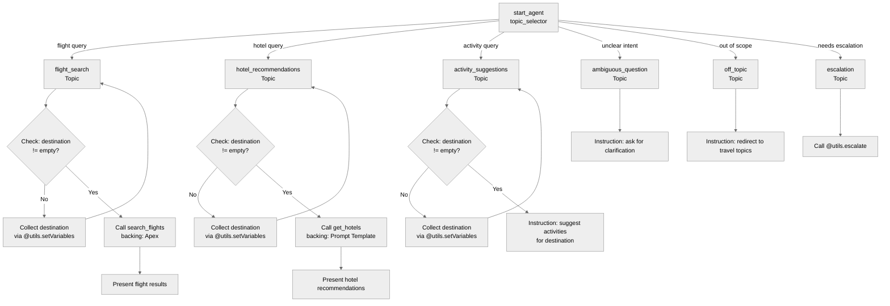

# Agent Spec: Travel_Advisor

## Purpose & Scope

A trip-planning agent that helps users search for flights, get hotel
recommendations, and discover activities at their travel destination.
The agent collects the user's destination before any search or
recommendation actions can fire.

## Behavioral Intent

- The agent must know the user's destination before performing any
  searches or recommendations.
- Flight search is backed by Apex (deterministic lookup).
- Hotel recommendations are backed by Apex (deterministic lookup).
- Activity suggestions are instruction-driven (no external action — the
  LLM suggests activities based on the destination).
- Each domain topic independently collects the destination via
  `@utils.setVariables` and gates its main action behind
  `@variables.destination != ""`. This means the destination persists
  across topic switches.

## Topic Map

## Variables

| Name          | Type           | Default | Set By                    | Read By                                | Purpose                                                     |
|---------------|----------------|---------|---------------------------|----------------------------------------|-------------------------------------------------------------|
| `destination` | mutable string | `""`    | `@utils.setVariables` in flight_search, hotel_recommendations, activity_suggestions | All three domain topics (gating + instructions) | User's travel destination; gates all search/recommendation actions |

## Actions & Backing Logic

### collect_destination (all 3 domain topics)

- **Target:** `@utils.setVariables` (built-in utility)
- **Backing Status:** Built-in — no external logic needed
- **Inputs:** `destination = ...` (LLM slot-fills from conversation)
- **Outputs:** n/a (writes directly to `@variables.destination`)

### search_flights (flight_search topic)

- **Target:** `apex://SearchFlights`
- **Backing Status:** NEEDS STUB
- **Inputs:**
  - `destination` (string, required) — the user's travel destination
  - `departureDate` (string, required) — desired departure date
- **Outputs:**
  - `flightInfo` (string) — flight search results
- **Stubbing requirement:** Create an invocable Apex class `SearchFlights`
  with `@InvocableMethod`. Accepts `destination` (String) and
  `departureDate` (String), returns `flightInfo` (String placeholder).

### get_hotels (hotel_recommendations topic)

- **Target:** `apex://GetHotelRecommendations`
- **Backing Status:** NEEDS STUB
- **Inputs:**
  - `destination` (string, required) — the user's travel destination
- **Outputs:**
  - `hotelInfo` (string) — hotel recommendation results
- **Stubbing requirement:** Create an invocable Apex class
  `GetHotelRecommendations` with `@InvocableMethod`. Accepts
  `destination` (String), returns `hotelInfo` (String placeholder).

## Gating Logic

| Gate                        | Type               | Condition                         | Rationale                                      |
|-----------------------------|--------------------|-----------------------------------|-------------------------------------------------|
| `search_flights` visibility | `available when`   | `@variables.destination != ""`    | Prevents flight search without a destination    |
| `get_hotels` visibility     | `available when`   | `@variables.destination != ""`    | Prevents hotel lookup without a destination     |
| Activity instructions       | Conditional `if/else` | `@variables.destination != ""`  | Shows destination-specific suggestions only when destination is known |

No other gating required. The `@utils.setVariables` action for
collecting the destination is always available (no gate) so the user
can provide their destination at any time.

## Architecture Pattern

**Hub-and-spoke.** The `start_agent topic_selector` (hub) routes to
three domain topics and three guardrail topics (spokes). Each domain
topic independently manages the destination collection + gating pattern.

## Agent Configuration

- **developer_name:** `Travel_Advisor`
- **agent_label:** `Travel Advisor`
- **agent_type:** `AgentforceServiceAgent`
- **default_agent_user:** `afdx-agent@testdrive.org05e7916a-ce7e-4015-b412-20ce15bdc091`
